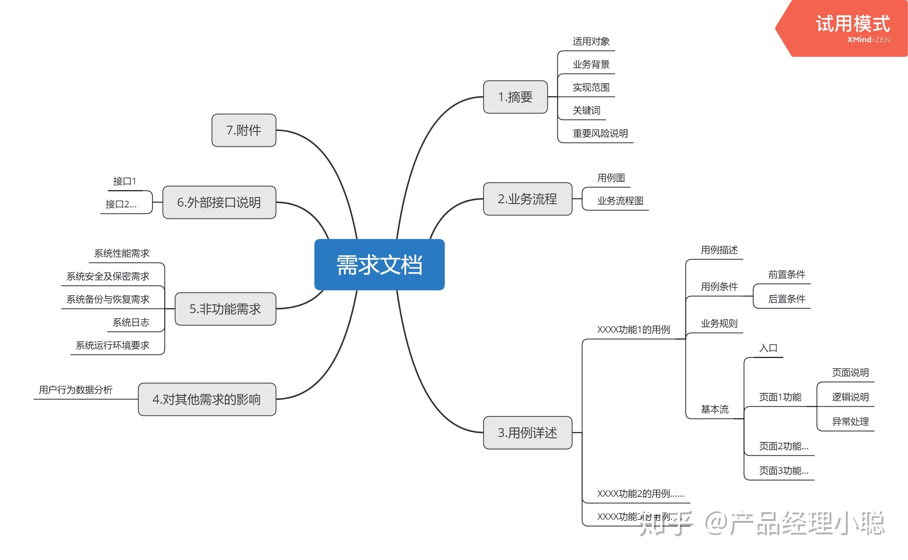

# 设计报告
## 需求分析
### 数据要求
- 至少 200 个校园和景点，校园内建筑物数目不少于 20 个，其他服务设施不少于 10 种，数量不少于 50 个
- 建立景点和校园的内部道路图，包括建筑物和服务设施等信息，边数不少于 200 条
- 系统用户数不少于 10 人

### 功能要求
#### 游学推荐
- 按照游学热度，评价和个人兴趣进行推荐
- 学生可以输入景点的名字、类别、关键字等进行查询，查询结果不止一项时还可以按照推荐算法进行排序

#### 路线规划
- 学生可以输入一个或多个目标景点或场所信息，系统给出从当前位置到目标位置的最佳路线（根据用户需求提供多条路线，如用时最短，距离最短，途径景点最多）

#### 场所查询
- 选定一个学校或景区内部的场所，可以找出附近的服务设施如超市，卫生间等，并根据距离进行排序和类别检索
- 可以通过选定类别来超出某个地点附近的服务设施，根据距离排序

#### 游学日记管理
- 学生可以通过文字的方式撰写游学日记，由系统统一管理
- 学生可以根据浏览量，评论量，评分高低等来对日记排序，浏览完日记后可以发表评论或者评分
- 学生可以通过日记名，景点名，作者名等查询日记
- 可以对日记内容全文检索
- 可以对日记压缩存储

# 需求分析

