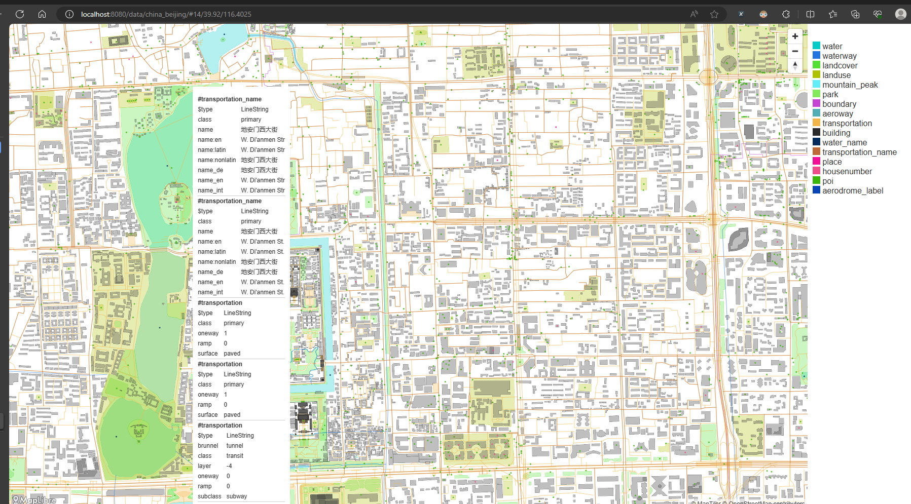
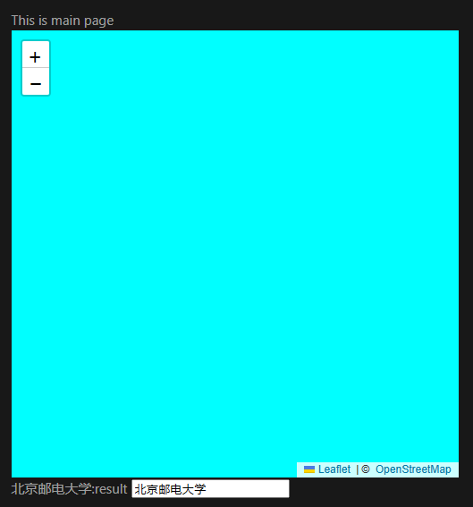

# 第五周周报

## 本周工作
- 完成基本数据类型的定义,包括:建筑物,景区,日记等,确定了每个基本类型的成员变量
- 实现推荐模块的排序算法,实现根据传入的对象数组和属性值完成以该对象特定属性排序的功能
- 利用openmap + leaflet 实现地图的显示
### 遇到的问题
访问osm api速度过慢，导致有时无法实现地图的显示，后从osm下载maptiles数据，进而使用tileserver实现本地地图服务器来提供tiles服务，但是tileserver能够正常访问，但是无法显示地图，前端访问tileserver的tiles服务时，得不到有效的tiles

可以看到tileserver能够正常运行，但是下图未能正确获取本地tileserver的api返回的图片，原因暂时不明

## 下周计划
- 完成推荐模块的开发,包括排序和推荐(协同过滤)
- 完成查询模块的开发