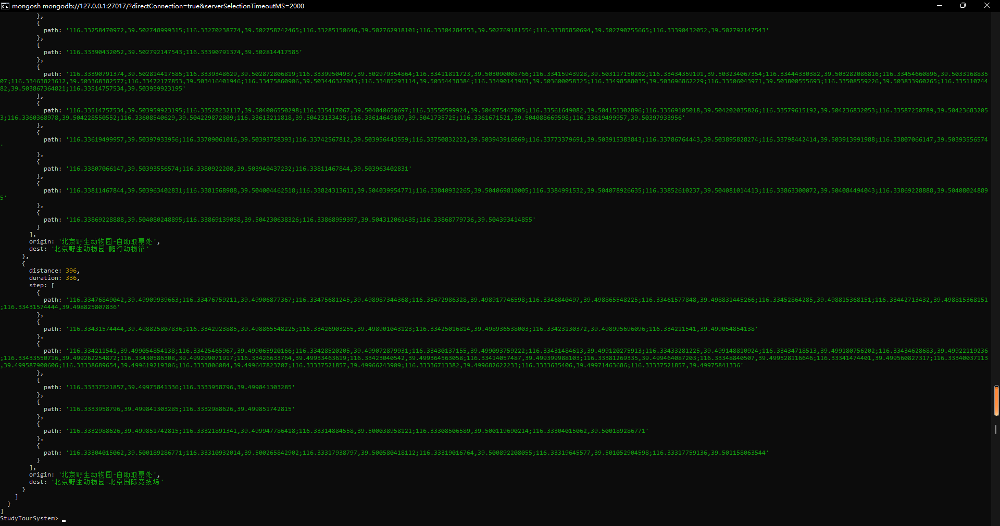

# 第九周周报

## 第十九小组 蔡逸文 宋健 李宇星

### 本周工作

完成真实景点数据的录入代码

主要代码如下
```python
# encoding:utf-8
from datetime import datetime
import asyncio
import requests
import time
import Scop
ak = "obh0u6Si9EEYanw8WI8x9CNtRqe0FYG4"


async def get_routes(origin_lat: float, origin_lng: float, dest_lat: float, dest_lng: float):
  # 接口地址
  url = "https://api.map.baidu.com/directionlite/v1/walking"

  params = {
      "origin":    f"{origin_lat},{origin_lng}",
      "destination":    f"{dest_lat},{dest_lng}",
      "ak":       ak,
  }

  response = requests.get(url=url, params=params)
  if response:
    data = response.json()["result"]
    res = dict()
    res["distance"] = data["routes"][0]["distance"]
    res["duration"] = data["routes"][0]["duration"]
    steps = []
    for step in data["routes"][0]["steps"]:
      temp = dict()
      temp["path"] = step["path"]
      steps.append(temp)
    res["step"] = steps
    return res


async def create_scop(data):
  # 接口地址
  url = "https://api.map.baidu.com/place/v2/suggestion"

  params = {
      "query":    data['name'],
      "region":    "北京",
      "city_limit":    "true",
      "output":    "json",
      "ak":       ak,

  }
  scop = Scop.Scop(data['name'], data['location']
                   ['lat'], data['location']['lng'])
  response = requests.get(url=url, params=params)
  if response:
    print(response.json())
    for build in response.json()['result']:
      scop.add_building(build['name'], build['location']
                        ['lat'], build['location']['lng'])
  for fro in scop.buildings:
    for to in scop.buildings:
      if fro.lat != to.lat and fro.lng != to.lng:  # 坐标不同
        routes = await get_routes(fro.lat, fro.lng, to.lat, to.lng)
        scop.add_route(fro.name, to.name, routes)
  await scop.save()


async def create_city(city_code: str):
  if not str.isdigit(city_code):
    return
  # 接口地址
  url = "https://api.map.baidu.com/place/v2/search"
  # 此处填写你在控制台-应用管理-创建应用后获取的AK
  params = {
      "query":    "景区",
      "tag":    "景区",
      "region":    city_code,
      "output":    "json",
      "ak":       ak,
      "scop": 2,
      "city_limit": True,
  }

  response = requests.get(url=url, params=params)
  if response:
    for scop in response.json()['results']:
      await create_scop(scop)
      time.sleep(0.1)
if __name__ == "__main__":
  async def main():
    await create_city("131")
    # with open("./BaiduMap_cityCode_1102.txt") as file:
    #   for city in file.readlines():
    #     await create_city(city.split(',')[0])
  asyncio.run(main())
  print("done")

```
完成导航界面的初步显示（但还存在轨迹坐标不对的问题）
### 下周安排

完善界面显示，修改上述bugsV
